# HealthApp-IOS

## Badges
 
 

## Description

`HealthApp-IOS` is a mobile application tailored to individual health and wellness. This repository presents snippets and elements from the app, demonstrating key functionalities and the application's UI. Due to privacy rights and intellectual property considerations, the complete application is not publicly available. Information and UI elements displayed here have been modified for sharing purposes.

## Table of Contents

- [Technologies Used](#technologies-used)
- [Challenges](#challenges)
- [Lessons](#lessons)
- [Usage](#usage)
- [Sign In Page](#sign-in-page)
- [Main Chatbot Page](#main-chatbot-page)
- [Diagnosis AI Page](#diagnosis-ai-page)
- [Other Chatbot Capabilites](#other-chatbot-capabilities)
- [Progress Page](#progress-page)
- [Articles Page](#articles-page)
- [Contact](#contact)

## Technologies Used

- **Flutter** for a unified UI/UX across platforms.
- **Firebase** for real-time data synchronization and user authentication.
- **TestFlight**: for deployment.

## Challenges

During the development, challenges such as adapting to mobile development, selecting suitable frameworks, dealing with iOS 17 updates and bugs in Xcode, and integrating Firebase for hosting and services were encountered and overcome.

## Lessons
The experience was enriching, imparting valuable lessons in mobile application development, problem-solving, and continuous learning.

## Usage

The app includes several key features, each with its dedicated UI. Here's how some of the core features are presented:

## Sign-In Page

The Sign-in In Page provides a secure entry point to the HealthApp-IOS. Utilizing Firebase Authentication, users can sign in through their Google accounts or email with account creation by the application owner. 

  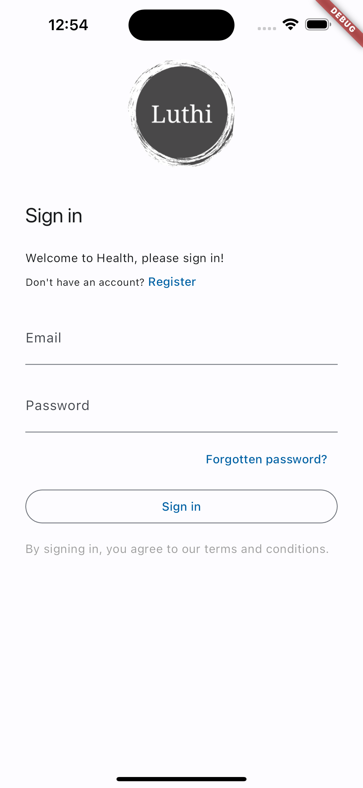

## Main Chatbot Page

The chat interface is built for dynamic conversations, enabling users to receive personalized advice, recommendations, and answers to health-related inquiries. This page is also includes shortcuts to specialized models in order to prevent use-case confusion, easy UI navigation and proof of concept. The chatbots are integrated to handle various topics including the examples below and more. 

  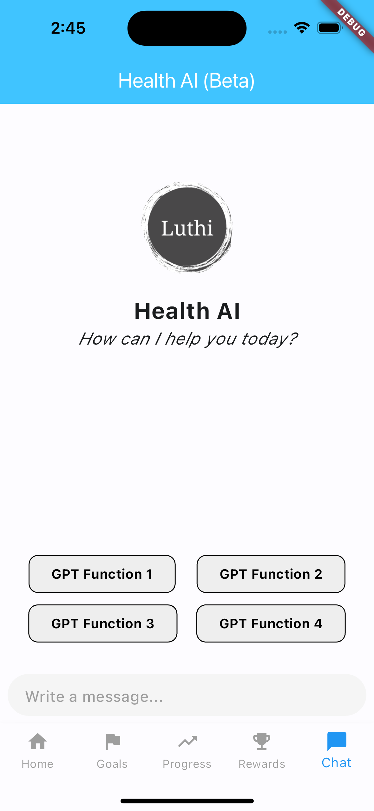
  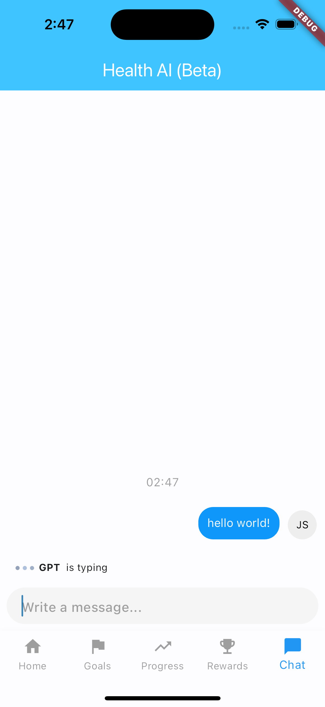
  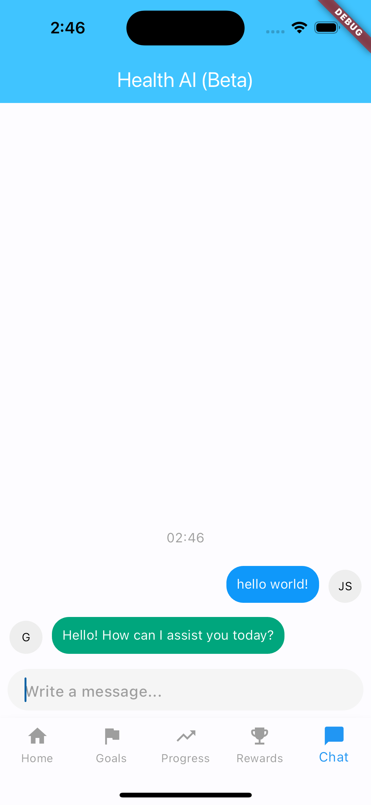

## Diagnosis AI Page

This page implements the diagnostic feature of the chatbot.

  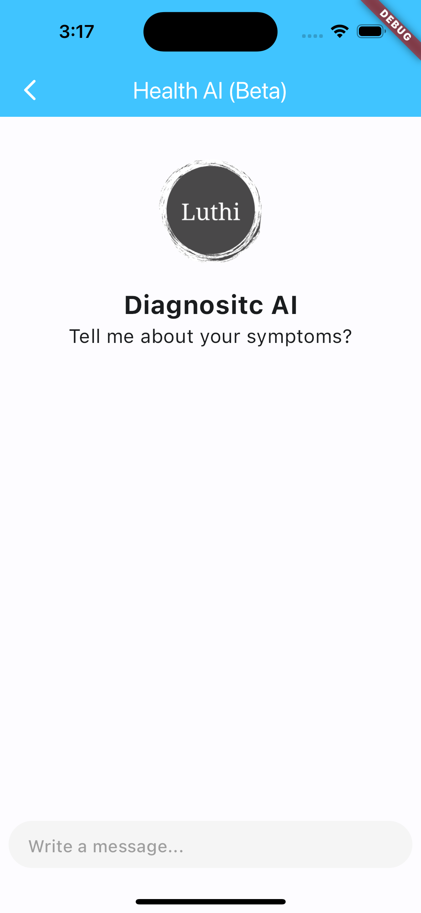
  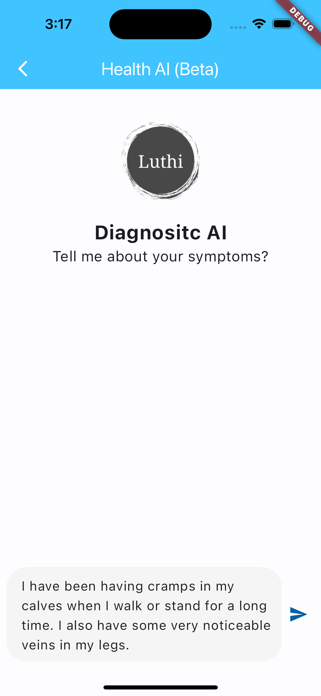
  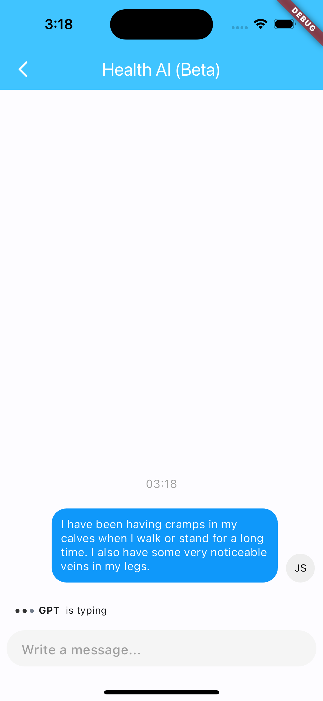
  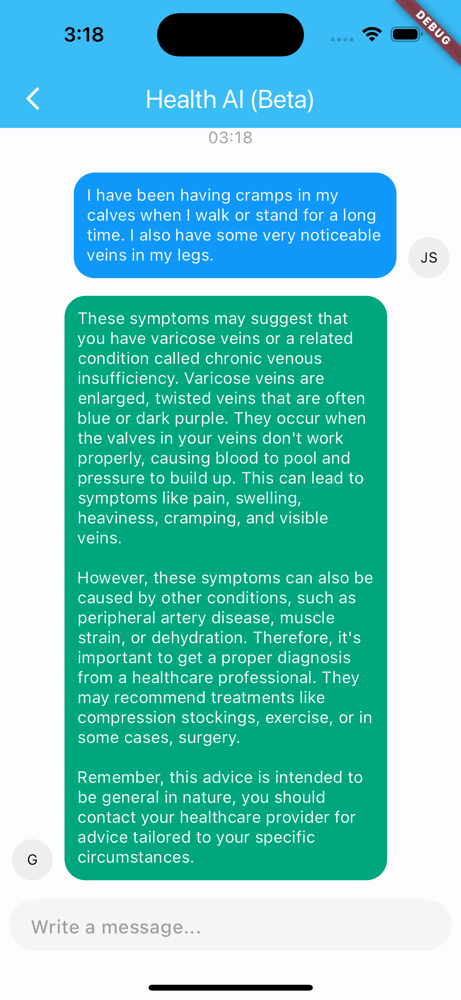

## Other Chatbot Capabilities

These examples show the page called when a shortcut is pressed on the `Main Chatbot Page` which featire additional capabilities the chatbot has and can cater to specific user question or request. 

  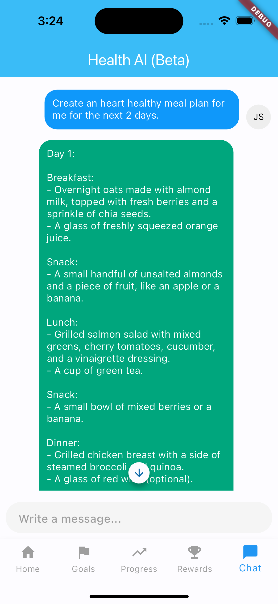
  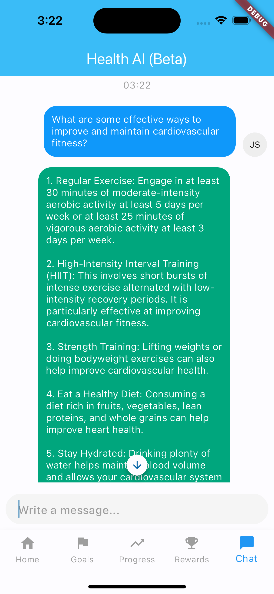

## Progress Page

The Progress Page is a motivational tool within the app that tracks and displays the user's health and wellness journey. The page utilizes widgets like PercentIndicator and FLChart to visualize the user's progress in a digestible and engaging format. Users can see at a glance how far they've come in their goals, whether it's related to fitness, meditation, or other health activities.

  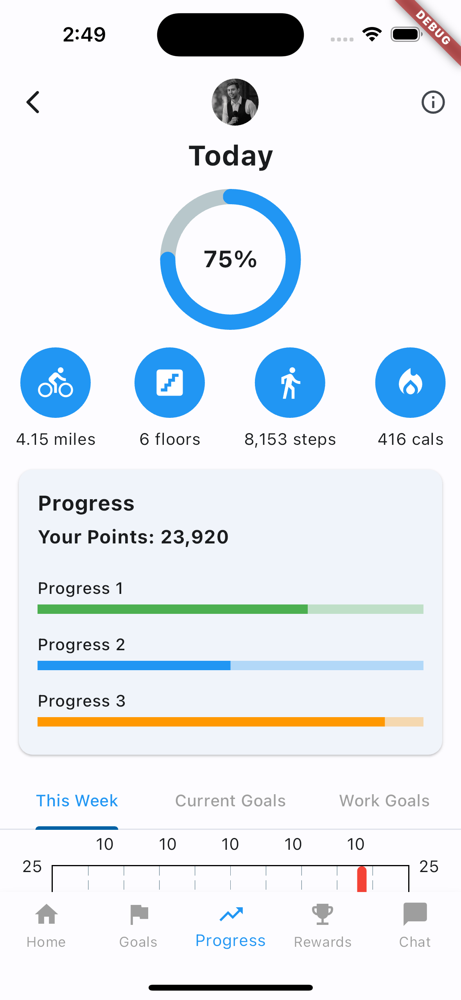
  

## Articles Page

The Articles page features a collection of wellness and health articles that users can browse. Selecting an article takes the user to an in-app browser where they can discover health-related topics.

  
  
  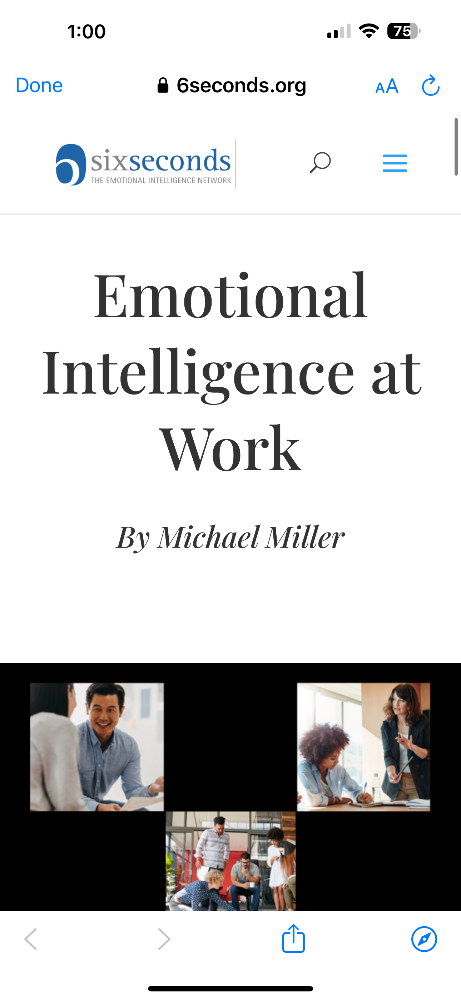

## Contact

 

